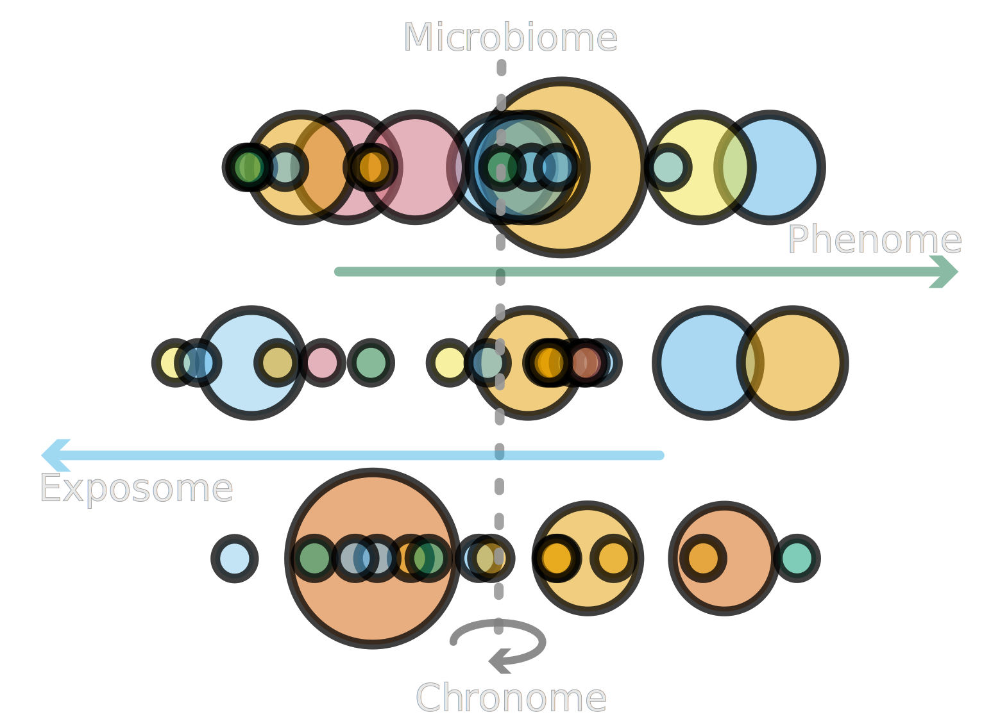

# OralMicroNHANES

<div align="center">
  

  [](https://opensource.org/licenses/MIT)
  [](https://www.r-project.org/)
  [](https://github.com/conda-forge/miniforge)
  [](https://slurm.schedmd.com/)
  [](https://doi.org/10.64898/2026.02.23.707541)
  [](https://doi.org/10.5281/zenodo.17849473)
  [](https://doi.org/10.5281/zenodo.17871009)
</div>

Pipeline accompanying the manuscript **"The Oral Microbiome Is a Population-Scale Readout of the Exposome, Age, and Systemic Health"** (Cho, Kostic, Tierney, Patel; 2026). It runs the **Oral MAS** framework — survey-weighted Microbiome-Wide Association Studies — on NHANES 2009–2012 oral microbiome data, integrates JGI-GOLD microbial phenotype annotations, and produces all tables and figures in the manuscript.

## Citation

If you use this code or the deposited data, please cite **all three** of the following:

- **Preprint:** Cho B, Kostic AD, Tierney BT, Patel CJ. *The Oral Microbiome Is a Population-Scale Readout of the Exposome, Age, and Systemic Health.* 2026. https://doi.org/10.64898/2026.02.23.707541
- **Input data deposit:** Cho B, Patel C. *Complete Input Data for Replicating OralMicroNHANES Analyses.* Zenodo, 2025. https://doi.org/10.5281/zenodo.17849473
- **Regression-output deposit:** Cho B, Patel C. *Complete Regression Output Data Generated by OralMicroNHANES Survey-Weighted Association Pipelines (v1.0.0).* Zenodo, 2025. https://doi.org/10.5281/zenodo.17871009

## Data availability

All primary input data are publicly available. Raw NHANES participant variables, oral-microbiome abundance tables, alpha/beta-diversity matrices, and GOLD-DB annotations are released by NHANES / NCHS and Vogtmann et al. (2023). The fully processed and integrated input dataset for this study is deposited at https://doi.org/10.5281/zenodo.17849473.

The intermediate per-dependent-variable RDS files, aggregated `*_complete.rds` tables, and supplementary CSVs produced by `scripts/0_transform_n_preprocess_ssfiles/` and `scripts/1_association_pipeline/` are **too large to host on GitHub**. The full set is deposited at https://doi.org/10.5281/zenodo.17871009.

Results may be reproduced via either of two pathways:

1. **Full re-execution from raw inputs.** Populate `data/` from the input-data deposit and re-run modules 0 → 1 → 2 → 3 → … → 10.
2. **Use of deposited regression outputs.** Populate `results/` from the regression-output deposit and run only the downstream modules (4–10, plus 2.5).

GitHub hosts the directory scaffold of `results/0_ss_files/` and `results/{1_demoWAS,2_oradWAS,3_exWAS,4_pheWAS,5_outWAS}_out/{result_clr,result_hellinger,result_lognorm,result_none}/` to preserve the expected layout; the per-dependent-variable RDS files within each `result_*/` are retrieved from Zenodo.

## Environment

A single conda environment (R 4.5.1, ~200 pinned R / Bioconductor packages) covers every script.

```bash
# Create
conda env create -f envs/nhanes-analysis_for_reviewers.yml
# Activate
conda activate nhanes-analysis-for-reviewers
```

On HPC (Slurm / O2) prepend `module purge && module load gcc/14.2.0 && module load conda/miniforge3/24.11.3-0 && eval "$(conda shell.bash hook)"` before the `conda activate`. Each runnable script also declares its own minimal env requirement at the top.

## Modules

Each module is fully documented by its own README and tool-version list. The table below indexes them.

| Module | Purpose | README |
|---|---|---|
| `0_transform_n_preprocess_ssfiles` | Microbiome normalization (none/Hellinger/CLR/log-norm), DB completion, build schema-structure CSVs | [module0_README.md](scripts/0_transform_n_preprocess_ssfiles/module0_README.md) |
| `1_association_pipeline` | Per-dependent-variable survey-weighted regression, aggregation + FDR + Storey q | [module1_README.md](scripts/1_association_pipeline/module1_README.md) |
| `2_preprocess_db_n_phyloseq` | Derive comprehensive demographics; build six phyloseq objects | [module2_README.md](scripts/2_preprocess_db_n_phyloseq/module2_README.md) |
| `2.5_general_summary_generation` | WAS variable summaries, binary-variable distributions, alpha-diversity stratification | [module2.5_README.md](scripts/2.5_general_summary_generation/module2.5_README.md) |
| `3_gold_db_microbial_phenotype` | Aggregate GOLD-DB by genus; produce the OTU-to-GOLD mapping used by downstream modules | [module3_README.md](scripts/3_gold_db_microbial_phenotype/module3_README.md) |
| `4_otu_host_plotting_standalone` | OTU × host effect-size scatter plots and diversity-index plots | [module4_README.md](scripts/4_otu_host_plotting_standalone/module4_README.md) |
| `5_age_analyses` | Age-stratified clustering (Ward.D2 + silhouette/gap), ecology-by-cluster, nativity composition | [module5_README.md](scripts/5_age_analyses/module5_README.md) |
| `5.5_smoking_analyses` | Smoking-exposure multicollinearity diagnostics across four measurement modalities | [module5.5_README.md](scripts/5.5_smoking_analyses/module5.5_README.md) |
| `6_alpha_beta_analyses` | Alpha/beta diversity, PCoA, centroid distances, KW/pairwise Wilcoxon, integrated panels | [module6_README.md](scripts/6_alpha_beta_analyses/module6_README.md) |
| `7_microbial_signature_heatmap` | Inverse-variance-weighted host-host signature correlation heatmaps | [module7_README.md](scripts/7_microbial_signature_heatmap/module7_README.md) |
| `8_network_analyses` | Host-microbe association networks (per-variable + grouped umbrella) | [module8_README.md](scripts/8_network_analyses/module8_README.md) |
| `9_biplot_n_categories_heatmap_fixed_kw_wilcoxon` | Abundance/prevalence biplot + categorical KW-Wilcoxon heatmaps | [module9_README.md](scripts/9_biplot_n_categories_heatmap_fixed_kw_wilcoxon/module9_README.md) |
| `10_prediction_analyses` | Elastic-net (glmnet) prediction of age, age group, and gender from CLR genus features (*exploratory; not included in the manuscript*) | [module10_README.md](scripts/10_prediction_analyses/module10_README.md) |

## Run order

Modules `0` and `1` produce the canonical preprocessed databases and regression tables that everything downstream reads:

```
0 -> 1 -> 2 -> 3 -> {2.5, 4, 5, 5.5, 6, 7, 8, 9, 10}
```

Downstream modules (2.5, 4–10) read the outputs of 0–3 and are otherwise independent of each other; run any in any order. Within each downstream module, follow the per-module README's run order.

Before running any module, open the target script(s) and set `PROJECT_ROOT` (top of file) to the absolute path of your local clone of this repository.

## Analysis types

The Oral MAS pipeline runs the **five MAS schemas** from Table 1 of the manuscript. Each schema is pre-specified across four normalization scenarios for robustness (20 model fits total); manuscript primary results use the **CLR** specification.

| Code | Schema (manuscript Table 1) | Link |
|---|---|---|
| `1_demoWAS` | Demographics → Microbiome | Linear |
| `2_oradWAS` | Microbiome → Oral Conditions | Logistic |
| `3_exWAS`   | Blood/Urine Markers → Microbiome | Linear |
| `4_pheWAS`  | Microbiome → Measured Phenotypes | Linear |
| `5_outWAS`  | Microbiome → Disease Incidents | Logistic |

Normalizations: `none` (raw relative abundance Pᵢ,ₘ), `clr` (centred log-ratio with pseudocount δ = 1), `hellinger` (√P), `lognorm` (log₁₀-CPM). Each schema adjusts for a 13-variable demographic covariate block Cᵢ (age, age², gender, race/ethnicity, education, nativity / US-born, poverty-to-income ratio); the Demographics → Microbiome schema is unadjusted by structural necessity (the covariate block would absorb the predictor of interest). NHANES design is declared with `SDMVSTRA` strata, `SDMVPSU` PSU clustering, and MEC weights `WTMEC2YR`/`WTMEC4YR` (pooled-cycle `WTMEC4YR = WTMEC2YR / 2`).

## Repository structure

```
OralMicroNHANES/
├── README.md
├── LICENSE.md
├── envs/
│   ├── nhanes-analysis_for_reviewers.yml         # conda spec (the only env)
│   └── README.md
├── configs/                                       # host-variable lists per MAS schema
│   ├── 1_demoWAS_vars.txt
│   ├── 2_oradWAS_vars.txt
│   ├── 3_exWAS_vars.txt
│   ├── 4_pheWAS_vars.txt
│   └── 5_outWAS_vars.txt
├── data/                                          # populate from Zenodo 10.5281/zenodo.17849473
│   ├── 00_GOLDdb/
│   ├── 00_nhanes_omp_abundance_db/
│   ├── 00_nhanes_omp_diversity_db/
│   ├── 00_nhanes_omp_transformed_db/
│   └── 00_silva_123.1/
├── results/                                       # outputs (large files from Zenodo 10.5281/zenodo.17871009)
│   ├── 0_ss_files/                                # 20 schema-structure CSVs (5 <MAS> x 4 normalizations)
│   ├── {1_demoWAS,2_oradWAS,3_exWAS,4_pheWAS,5_outWAS}_out/
│   │   └── result_{none,hellinger,clr,lognorm}/
│   │       ├── <dep_var>.rds                      # per-dep-var regression output
│   │       └── <scheme>_{tidied,glanced,rsq}_complete.rds
│   ├── intermediate/                              # updated phyloseq objects used by some downstream modules
│   ├── supplementary_tables/                      # module 1 aggregation summaries (s_table_*.csv)
│   └── analyses_results/                          # outputs of modules 2, 2.5, 3, 4-10
│       ├── 2_preprocess_db_n_phyloseq_out/
│       ├── 2.5_general_summary_generation/
│       ├── 3_gold_db_microbial_phenotype_out/
│       ├── 4_otu_host_plot_out/  (+ _additional/)
│       ├── 5_age_analyses_out/   (+ _additional/, _additional_k_choices/)
│       ├── 5.5_smoking_analyses_out_additional/
│       ├── 6_alpha_beta_analyses_out/
│       ├── 7_microbial_signature_heatmap_out/
│       ├── 8_network_analyses_out/ (+ _additional/)
│       ├── 9_biplot_n_categories_heatmap_fixed_kw_wilcoxon_out/
│       └── 10_prediction_analyses_out/
└── scripts/
    ├── 0_transform_n_preprocess_ssfiles/
    ├── 1_association_pipeline/
    ├── 2_preprocess_db_n_phyloseq/
    ├── 2.5_general_summary_generation/
    ├── 3_gold_db_microbial_phenotype/
    ├── 4_otu_host_plotting_standalone/
    ├── 5_age_analyses/
    ├── 5.5_smoking_analyses/
    ├── 6_alpha_beta_analyses/
    ├── 7_microbial_signature_heatmap/
    ├── 8_network_analyses/
    ├── 9_biplot_n_categories_heatmap_fixed_kw_wilcoxon/
    └── 10_prediction_analyses/
```

## Methods by module

| Module | Method / statistical approach |
|---|---|
| `0` | Compositional transforms of genus abundance — `none` (P), `hellinger` (√P), `clr` (centred log-ratio, pseudocount δ = 1), `lognorm`. Schema-structure CSVs for each (host variable × genus) pair. |
| `1` | Survey-weighted GLMs (`survey::svyglm` v4.4-2) per (host var × genus) pair under NHANES MEC design (`SDMVSTRA` / `SDMVPSU` / `WTMEC2YR`–`WTMEC4YR`); Taylor-linearized SE; 13-variable demographic covariate block C_i; `quasibinomial()` for binary outcomes. Scheme-wise BH-FDR + Storey q-values; manuscript joint rule BH-FDR ≤ 0.05 AND q ≤ 0.05. |
| `2` | Derive ~50 demographic variables from NHANES `DEMO_F/G` (factors, quartiles, dummies); build six normalization-specific phyloseq objects. |
| `2.5` | MAS variable summaries; binary-variable distributions with Wilson 95 % CIs; alpha-diversity stratification by demographic group. |
| `3` | JGI-GOLD phenotype mapping at genus level: oxygen index (ordinal 0–1), Gram / motility / sporulation indices (binary, averaged within genus); within-genus species concordance reported as high/medium/low. |
| `4` | "Terry" effect-size scatter plots of MAS coefficients with discrete FDR-tiered point sizing and phylum colouring; baseline + dual-threshold (BH-FDR ≤ 0.05 AND q ≤ 0.05) variants. |
| `5` | Hierarchical clustering on z-scored age-binned mean abundances (Ward.D2 / Euclidean); silhouette + gap statistic for k selection; 100-bootstrap Jaccard stability; Kruskal–Wallis + BH per-genus age-group tests; PCA / t-SNE / PERMANOVA (9,999 permutations) for validity. |
| `5.5` | Multicollinearity diagnostics for the 24-variable smoking/combustion set across four modalities (questionnaire, U-PAH, U-MM, B-VOC): 24 × 24 Spearman covariance, per-modality PCA, 4 × 4 Jaccard similarity of FDR-significant taxa sets. |
| `6` | Alpha (Observed OTUs / Shannon / Inverse Simpson) + beta (Bray–Curtis, weighted / unweighted UniFrac) diversity; PCoA; centroid-distance distributions; Kruskal–Wallis + pairwise Wilcoxon per categorical variable with BH adjustment. |
| `7` | Inverse-variance-weighted Pearson correlation of per-host β-vectors over shared genera with weight w_m = 1 / (σ²_{h_i,m} + σ²_{h_j,m}); effective-N–based t test; BH-adjusted; silhouette-driven optimal-k row/column splits. |
| `8` | Host–microbe association networks (`igraph` + `ggraph`): edge weight w_{ij} = \|β_{m_i,h} · β_{m_j,h}\|, direction-concordance edge colour, compact node selection (top 15 positive + 15 negative by \|β\|). |
| `9` | Top-15 taxa biplot per taxonomic rank (abundance × prevalence); per-MAS-factor Kruskal–Wallis (≥3 levels) or Wilcoxon (binary) with BH-FDR; top-30 ranked taxa pheatmap with phylum row annotations. |
| `10` | Elastic-net (`glmnet`, α = 0.5) prediction of age / age-group / gender from CLR genus features; 5-fold CV; unweighted and survey-weighted (`WTMEC2YR`) test-set metrics. *Exploratory; not in manuscript.* |

## **Authors & Contributors**
<table align="center">
  <tr>
    <td align="center">
      <a href="https://github.com/terry-b-cho">
        <br/>
        
      </a>
    </td>
    <td align="center">
      <a href="https://github.com/adkostic">
        <br/>
        
      </a>
    </td>
    <td align="center">
      <a href="https://github.com/b-tierney">
        <br/>
        
      </a>
    </td>
    <td align="center">
      <a href="https://github.com/chiragjp">
        <br/>
        
      </a>
    </td>
  </tr>
</table>

## License

MIT — see [LICENSE.md](LICENSE.md).
